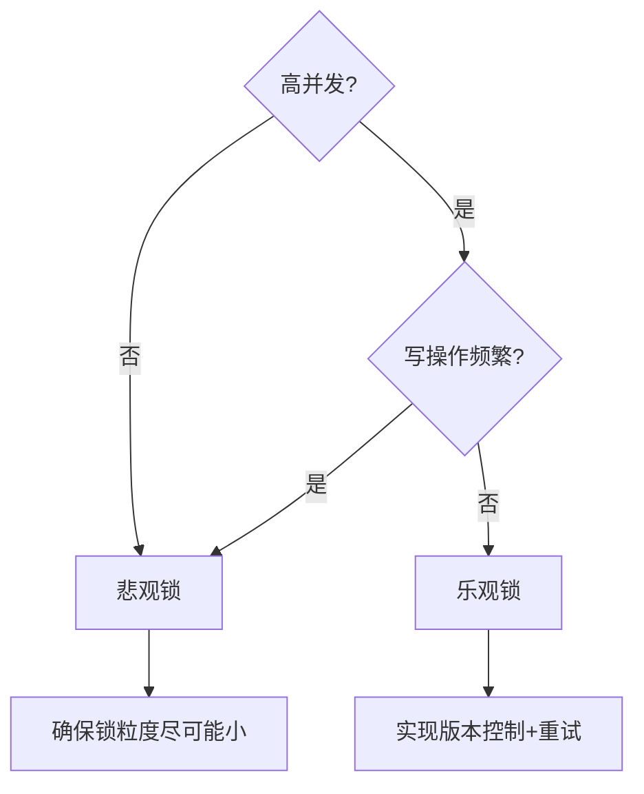

乐观锁和悲观锁是两种不同的并发控制策略，用于解决多线程/多进程环境下数据竞争的问题。它们的核心区别在于 **对冲突的预期态度** 和 **实现方式**。

---

### **一、悲观锁（Pessimistic Locking）**
#### **1. 核心思想**
- **假设**：认为并发操作中**一定会发生冲突**，因此每次访问数据前先加锁。
- **行为**：**“先锁后改”**，确保同一时间只有一个线程能操作数据。
- **类比**：像上厕所锁门，默认其他人会抢资源。

#### **2. 实现方式**
- **数据库**：`SELECT ... FOR UPDATE`（行锁/表锁）
- **编程语言**：`synchronized`（Java）、`threading.Lock`（Python）
  
```sql
-- 数据库悲观锁示例（MySQL）
BEGIN;
SELECT * FROM accounts WHERE id = 1 FOR UPDATE; -- 加锁
UPDATE accounts SET balance = balance - 100 WHERE id = 1;
COMMIT;
```

#### **3. 适用场景**
✅ **冲突频繁**的环境（如电商秒杀）  
✅ **长事务**（操作耗时，需长期独占资源）  
✅ **强一致性**要求（如银行转账）

#### **4. 优缺点**
| 优点                      | 缺点                          |
|---------------------------|-------------------------------|
| 保证数据强一致性          | 并发性能低（阻塞其他线程）    |
| 实现简单                  | 死锁风险高                    |

---

### **二、乐观锁（Optimistic Locking）**
#### **1. 核心思想**
- **假设**：认为并发操作中**很少发生冲突**，因此不加锁直接操作，提交时检测冲突。
- **行为**：**“先改后验”**，通过版本号/时间戳等机制验证数据是否被修改。
- **类比**：像多人编辑文档，提交时检查是否有冲突。

#### **2. 实现方式**
- **数据库**：版本号（`version`字段）、CAS（Compare-And-Swap）
- **编程语言**：原子类（如Java的`AtomicInteger`）、无锁数据结构

```sql
-- 数据库乐观锁示例（MySQL）
UPDATE products 
SET stock = stock - 1, version = version + 1 
WHERE id = 10 AND version = 5; -- 检查版本号
-- 若受影响行数为0，说明版本号已变更，需重试
```

#### **3. 适用场景**
✅ **读多写少**（如文章点赞）  
✅ **高并发**（减少锁竞争）  
✅ **短事务**（冲突概率低）

#### **4. 优缺点**
| 优点                      | 缺点                          |
|---------------------------|-------------------------------|
| 高并发性能（无阻塞）      | 实现复杂（需处理重试/冲突）   |
| 避免死锁                  | 不保证实时一致性               |

---

### **三、关键对比**
| 维度         | 悲观锁                          | 乐观锁                          |
|--------------|--------------------------------|--------------------------------|
| **冲突预期** | 假定总会冲突                   | 假定很少冲突                   |
| **加锁时机** | 操作前加锁                    | 提交时检查冲突                 |
| **实现复杂度** | 简单                          | 需版本控制/重试机制            |
| **性能**     | 低（阻塞等待）                | 高（无阻塞）                  |
| **典型应用** | 数据库行锁、Java `synchronized` | 版本控制（Git）、CAS操作       |

---

### **四、实战选择建议**
#### **1. 选型决策树**


#### **2. 混合使用案例**
- **库存扣减**：  
  1. 先用乐观锁尝试扣减（高并发场景）  
  2. 若冲突频繁，降级为悲观锁（如秒杀后期）

```java
// 伪代码：乐观锁+重试
int maxRetries = 3;
while (maxRetries-- > 0) {
    Product p = dao.getProduct(id);
    int oldVersion = p.getVersion();
    p.setStock(p.getStock() - 1);
    if (dao.updateWithVersion(p, oldVersion)) { // CAS操作
        break; // 成功
    }
}
if (maxRetries <= 0) {
    // 改用悲观锁
    lock.lock();
    try {
        // 处理订单
    } finally {
        lock.unlock();
    }
}
```

---

### **五、扩展知识**
#### **1. 乐观锁的ABA问题**
- **现象**：版本号从A→B→A，CAS误判无冲突。  
- **解决**：  
  - 使用递增版本号（非布尔值）  
  - 追加时间戳（如`version=timestamp+counter`）

#### **2. 悲观锁的锁升级**
- **优化手段**：  
  - 读锁（共享锁）→ 写锁（排他锁）  
  - 减少锁粒度（如行锁替代表锁）

#### **3. 分布式锁场景**
- **悲观锁**：Redis的`SETNX` + 过期时间  
- **乐观锁**：ZooKeeper的版本号（`zxid`）

---

### **总结**
- **悲观锁**：适合强一致性、短生命周期的临界资源。  
- **乐观锁**：适合高并发、低冲突的读写分离场景。  
- **终极建议**：  
  - 先分析业务冲突概率  
  - 通过压测验证锁性能  
  - 必要时结合两者优势（如乐观锁+熔断降级）