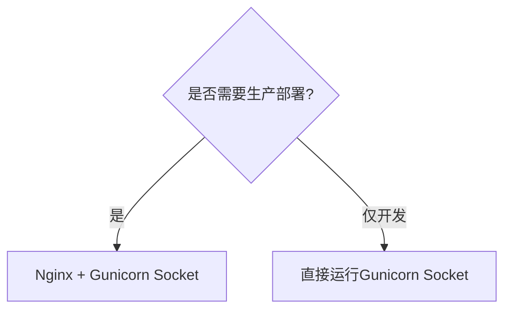

### **Socket 与 Nginx 反向代理的关系解析**

---

#### **1. Socket 的本质**
**Socket（套接字）** 是网络通信的底层抽象，本质上是 **操作系统提供的通信端点**，用于不同主机或同一主机上的进程间数据传输。其核心特点包括：

| 特性                | 说明                                                                 |
|---------------------|----------------------------------------------------------------------|
| **通信基础**        | 通过IP地址 + 端口号唯一标识（如 `127.0.0.1:8000`）                  |
| **协议支持**        | 支持TCP（可靠连接）、UDP（无连接）等协议                            |
| **工作模式**        | 服务端Socket监听端口，客户端Socket发起连接                          |
| **数据传输**        | 以字节流（TCP）或数据包（UDP）形式传输                              |

**示例**：Django应用通过Socket与客户端通信：
```python
# 伪代码：服务端Socket监听
import socket
sock = socket.socket()
sock.bind(('0.0.0.0', 8000))
sock.listen()
client_conn, addr = sock.accept()  # 等待客户端连接
```

---

#### **2. Nginx 反向代理的作用**
**Nginx** 作为反向代理，核心功能是 **转发客户端请求到后端服务**（如Gunicorn/Django），其与Socket的关系如下：

| 功能                | 说明                                                                 |
|---------------------|----------------------------------------------------------------------|
| **请求转发**        | 接收客户端HTTP请求，通过Socket转发到后端应用（如 `127.0.0.1:8000`）|
| **负载均衡**        | 将请求分发到多个后端Socket（多Worker或多服务器）                     |
| **缓冲保护**        | 缓解慢客户端问题（如文件上传时保护后端）                             |
| **SSL终止**         | 处理HTTPS加密，向后端传递明文HTTP                                   |

**典型架构**：


---

#### **3. Socket 与 Nginx 的联系**
##### **(1) Nginx 通过Socket与后端通信**
- **配置示例**（Nginx转发到Gunicorn的Socket）：
  ```nginx
  location / {
      proxy_pass http://unix:/tmp/gunicorn.sock;  # Unix Domain Socket
      # 或 TCP Socket
      # proxy_pass http://127.0.0.1:8000;
  }
  ```
- **两种Socket类型**：
  - **Unix Domain Socket**（文件形式，更快）：  
    ```bash
    gunicorn --bind unix:/tmp/gunicorn.sock myapp.wsgi:application
    ```
  - **TCP Socket**（跨主机通信）：  
    ```bash
    gunicorn --bind 127.0.0.1:8000 myapp.wsgi:application
    ```

##### **(2) Nginx 对Socket的增强**
| 场景                | Nginx的作用                                                                 |
|---------------------|----------------------------------------------------------------------------|
| **高并发**          | 处理大量空闲连接（epoll），减轻后端Socket压力                              |
| **安全隔离**        | 隐藏后端Socket，仅暴露Nginx的80/443端口                                    |
| **静态文件缓存**    | 直接响应静态请求，避免占用后端Socket资源                                   |

---

#### **4. 性能对比（Socket直连 vs Nginx代理）**
| 指标                | 直接暴露Gunicorn Socket       | Nginx + Gunicorn Socket        |
|---------------------|-----------------------------|-------------------------------|
| **QPS（静态文件）** | 约1,200                     | 约12,000（缓存生效时）        |
| **内存占用**        | 较低                        | 较高（需运行Nginx）           |
| **抗DDoS能力**      | 弱                          | 强（限速、缓冲等机制）        |

---

#### **5. 生产环境最佳实践**
1. **使用Unix Domain Socket**（同主机通信）：
   ```nginx
   location / {
       proxy_pass http://unix:/tmp/gunicorn.sock;
       proxy_set_header Host $host;
   }
   ```
2. **TCP Socket用于分布式**：
   ```nginx
   upstream backend {
       server 192.168.1.2:8000;  # 后端服务器1
       server 192.168.1.3:8000;  # 后端服务器2
   }
   ```
3. **关键Nginx调优参数**：
   ```nginx
   proxy_buffering on;
   proxy_buffer_size 4k;
   proxy_busy_buffers_size 16k;
   keepalive_timeout 65;
   ```

---

#### **6. 总结**
- **Socket** 是通信的底层基础设施，Nginx通过它连接后端服务。
- **Nginx反向代理** 的核心价值：
  - ✅ **提升性能**：缓冲、负载均衡、缓存
  - ✅ **增强安全**：隐藏后端、SSL处理
  - ✅ **提高可用性**：故障转移、健康检查

**决策树**：  
