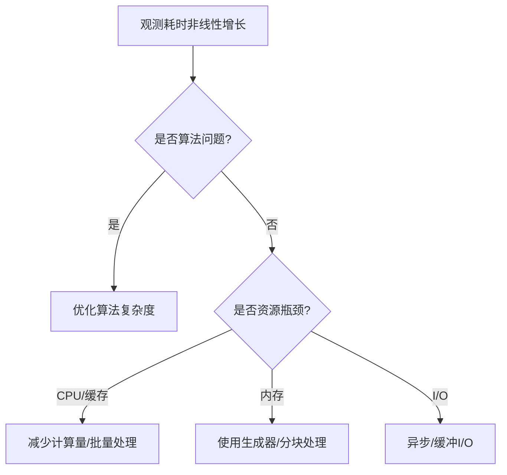

这种现象（任务量增加导致单线程处理时间非线性增长）主要由以下几个关键因素导致，涉及计算机科学中的 **时间复杂度**、**硬件资源限制** 和 **系统调度开销**：

---

### **1. 时间复杂度与算法效率**
#### **(1) 线性 vs 非线性时间复杂度**
- **理想情况**：若任务处理是严格的线性时间复杂度（O(n)），500任务耗时6秒 → 2000任务应耗时约24秒（6×4）。
- **实际观察**：90秒远超线性增长，表明存在 **非线性时间复杂度（如O(n²)、O(n log n)）** 或 **资源竞争瓶颈**。

#### **(2) 常见非线性场景**
| 场景                | 时间复杂度 | 示例                                                                 |
|---------------------|------------|----------------------------------------------------------------------|
| **嵌套循环**        | O(n²)      | 对每个任务与其他任务比较（如去重操作）                               |
| **重复计算**        | O(n^m)     | 未缓存中间结果（如递归无记忆化）                                     |
| **排序/搜索**       | O(n log n) | 任务处理前需动态排序                                                 |

**示例代码**：
```python
# O(n²) 的耗时操作（双重循环）
def process_tasks(tasks):
    results = []
    for i in tasks:          # 外层循环
        for j in tasks:      # 内层循环
            results.append(i + j)  # 无意义的重复计算
    return results
```

---

### **2. 硬件资源瓶颈**
#### **(1) 内存访问延迟**
- **缓存失效**：当数据量超过CPU缓存（L1/L2/L3）容量时，频繁访问主内存（速度差10~100倍）。
- **示例**：处理2000个任务时，缓存命中率下降，内存带宽成为瓶颈。

#### **(2) 内存管理开销**
- **垃圾回收（GC）**：某些语言（如Python/Java）在内存压力大时触发GC，导致暂停。
- **分页/交换**：物理内存不足时，操作系统将数据交换到磁盘（极端情况下耗时激增）。

#### **(3) 存储I/O阻塞**
- **磁盘/网络访问**：若任务涉及读写文件或网络请求，I/O延迟会随任务量累积。

---

### **3. 操作系统调度开销**
#### **(1) 上下文切换成本**
- 单线程虽无线程切换，但可能因 **系统调用**（如I/O操作）触发内核态/用户态切换。
- **系统调用风暴**：大量短时系统调用（如`write()`）导致频繁模式切换。

#### **(2) 中断处理**
- 硬件中断（如网卡收包）会抢占CPU资源，高负载时更频繁。

---

### **4. 编程语言特性（以Python为例）**
#### **(1) GIL（全局解释器锁）**
- 即使单线程，某些操作（如字节码执行、内存分配）仍需竞争GIL，引入隐性等待。

#### **(2) 动态类型开销**
- 类型检查、方法解析等操作随任务量增加而累积。

---

### **5. 问题定位方法**
#### **(1) 性能分析工具**
```bash
# Python示例：用cProfile分析
python -m cProfile -s cumulative my_script.py
```
输出示例：
```
2000    4.567    0.002    4.567    0.002 {built-in method io.open}  # I/O瓶颈
2000    3.891    0.001    3.891    0.001 {method 'sort' of 'list' objects}  # 排序瓶颈
```

#### **(2) 监控系统资源**
```bash
# Linux下监控CPU/内存
top -p $(pgrep -f my_script)
# 或使用更详细的工具
perf stat -e cpu-cycles,cache-misses python my_script.py
```

---

### **6. 优化策略**
#### **(1) 算法优化**
| 原复杂度 | 优化手段              | 改进后复杂度 |
|----------|-----------------------|--------------|
| O(n²)    | 使用哈希表去重        | O(n)         |
| O(n log n) | 预处理数据避免重复排序 | O(n)         |

#### **(2) 硬件资源利用**
- **批量处理**：合并I/O操作（如一次读取所有文件）
- **内存优化**：使用生成器（Python的`yield`）替代列表

#### **(3) 并发/异步处理**
```python
# 异步I/O示例（Python asyncio）
async def process_task(task):
    await asyncio.sleep(0.1)  # 模拟I/O
    return task * 2

async def main():
    tasks = [process_task(i) for i in range(2000)]
    await asyncio.gather(*tasks)
```

---

### **总结：非线性耗时增长的根本原因**
1. **算法缺陷**：未优化的嵌套循环或重复计算。
2. **资源竞争**：内存/缓存/磁盘I/O达到瓶颈。
3. **系统开销**：调度、中断、GC等隐性成本累积。

**解决路径**：  


通过针对性优化，可将耗时恢复至近似线性增长。