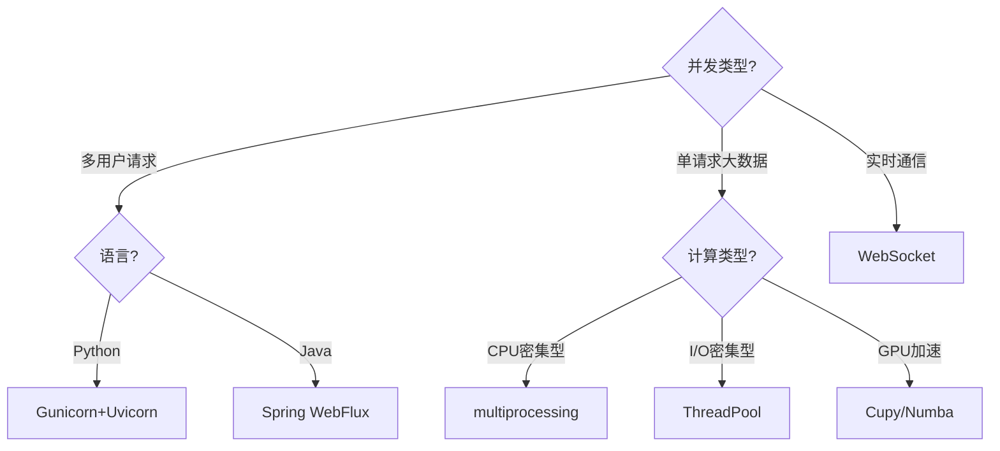

在并发编程中，针对你提到的两种场景以及其他常见场景，以下是详细的实现方案和技术选型建议：

---

### **一、并发处理多个用户请求**
#### **场景特点**：
- 高并发用户访问（如电商秒杀、API服务）
- 需要快速响应每个轻量级请求

#### **实现方案**：
| 技术               | 适用框架/工具                  | 示例代码                                                                 | 优点                          | 缺点                          |
|--------------------|-------------------------------|--------------------------------------------------------------------------|-------------------------------|-------------------------------|
| **多进程**         | Django + Gunicorn (pre-fork)  | `gunicorn --workers=4 --threads=2 app:wsgi`                             | 隔离性好，稳定性高            | 内存占用高                    |
| **异步I/O**        | FastAPI/Starlette             | `uvicorn main:app --workers 4`                                          | 高吞吐量（数万QPS）           | 需异步兼容代码                |
| **线程池**         | Flask + concurrent.futures    | ```python<br>with ThreadPoolExecutor() as executor:<br>    executor.map(handle_request, requests)``` | 开发简单                      | GIL限制（CPU密集型效率低）    |
| **事件驱动**       | Node.js/Tornado               | `tornado.gen.coroutine`                                                 | 适合长连接服务                | 回调地狱风险                  |

#### **技术栈推荐**：
1. **Python Web服务**：  
   - 首选：Gunicorn（多Worker） + Uvicorn（异步Worker）  
   - 备选：Gevent（协程）  
2. **Java/Go**：  
   - Go原生协程 / Java Vert.x

---

### **二、单个请求内大数据处理**
#### **场景特点**：
- 单个请求需处理GB级数据（如报表生成、视频转码）
- 需并行化计算任务

#### **实现方案**：
| 技术               | 适用场景                      | 示例代码                                                                 | 关键点                        |
|--------------------|-----------------------------|--------------------------------------------------------------------------|-------------------------------|
| **多线程**         | CPU密集型+Python            | ```python<br>from concurrent.futures import ThreadPoolExecutor<br>with ThreadPoolExecutor(max_workers=8) as e:<br>    e.submit(process_data, chunk)``` | 受GIL限制，适合I/O密集型       |
| **多进程**         | CPU密集型                   | ```python<br>from multiprocessing import Pool<br>with Pool(processes=4) as p:<br>    p.map(heavy_compute, data)``` | 绕过GIL，内存隔离             |
| **GPU加速**        | 矩阵运算/深度学习            | ```python<br>import cupy as cp<br>cp.array(data) * cp.array(weights)```  | 需NVIDIA CUDA环境             |
| **分布式任务**     | 超大规模数据                 | Celery + Redis/RabbitMQ                                                 | 支持跨节点扩展                |

#### **优化技巧**：
1. **分块处理**：  
   ```python
   # 大数据分片并行处理
   chunk_size = len(data) // os.cpu_count()
   chunks = [data[i:i+chunk_size] for i in range(0, len(data), chunk_size)]
   ```
2. **内存映射**：  
   ```python
   import numpy as np
   arr = np.memmap('large_file.dat', dtype='float32', mode='r', shape=(1000000,))
   ```

---

### **三、其他常见并发场景**
#### **1. 长连接/实时通信**
- **场景**：WebSocket消息推送、在线协作编辑
- **方案**：  
  - Django Channels（Python）  
  - Socket.IO（Node.js）  
  ```python
  # Django Channels示例
  async def websocket_receive(self, event):
      await self.send({"type": "websocket.send", "text": "Hello!"})
  ```

#### **2. 定时任务调度**
- **场景**：每日报表生成、缓存刷新
- **方案**：  
  - Celery Beat  
  - APScheduler  
  ```python
  scheduler.add_job(func=generate_report, trigger='cron', hour=2)
  ```

#### **3. 流式数据处理**
- **场景**：日志实时分析、IoT设备数据流
- **方案**：  
  - Kafka + Spark Streaming  
  - Python生成器  
  ```python
  def stream_data():
      while True:
          yield get_live_sensor_data()
  ```

---

### **四、技术选型决策树**


---

### **五、避坑指南**
1. **Python GIL问题**：
   - CPU密集型任务避免用多线程，改用多进程或C扩展
2. **资源竞争**：
   - 使用线程安全数据结构（`queue.Queue`）
   - 分布式锁（Redis Redlock）
3. **内存泄漏**：
   - 多进程场景注意共享内存管理（`multiprocessing.Array`）

---

### **总结**
- **多用户请求**：横向扩展（负载均衡）+ 异步I/O
- **单请求大数据**：纵向并行化（多进程/GPU）+ 分治策略
- **其他场景**：根据实时性/数据量选择专用方案（如WebSocket/Kafka）

根据实际业务需求组合这些技术，可构建高性能的并发系统。