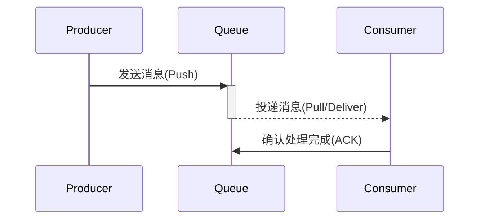

消息队列（Message Queue）是一种**异步通信机制**，其核心原理是通过**存储-转发**模式解耦生产者和消费者，底层数据结构设计直接影响性能和特性。以下是详细解析：

---

### **一、消息队列基本原理**
#### **1. 核心工作流程**

- **生产者（Producer）**：产生消息并发送到队列。
- **队列（Queue）**：持久化存储消息，确保不丢失。
- **消费者（Consumer）**：从队列获取消息并处理，成功后发送确认。

#### **2. 关键特性**
| 特性                | 说明                                                                 |
|---------------------|----------------------------------------------------------------------|
| **解耦**            | 生产者和消费者无需相互感知或同时在线                                 |
| **削峰填谷**        | 缓冲突发流量，避免系统过载                                           |
| **异步通信**        | 生产者发送后无需等待消费者处理                                       |
| **顺序保证**        | 部分队列支持消息顺序性（如Kafka分区）                                |
| **重试机制**        | 消费者失败后消息可重新投递                                           |

---

### **二、底层数据结构**
不同消息队列根据场景选择不同数据结构，常见实现如下：

#### **1. 链表（Linked List）**
- **典型队列**：RabbitMQ（普通队列）、Redis List。
- **特点**：
  - 内存连续性好，支持高效头尾操作。
  - 时间复杂度：`O(1)` 入队/出队。
- **局限**：随机访问性能差（但消息队列通常不需要）。

#### **2. 日志文件（Append-Only Log）**
- **典型队列**：Kafka、RocketMQ。
- **特点**：
  - 消息以**顺序追加**方式写入磁盘文件。
  - 通过**偏移量（Offset）**定位消息，支持随机读。
  - 零拷贝技术（`sendfile`）提升吞吐量。
- **优势**：高吞吐、持久化、支持回溯消费。

#### **3. 树/哈希表（Tree/Hash）**
- **特殊场景**：
  - **优先级队列**：使用堆（如RabbitMQ的优先级队列）。
  - **延时队列**：时间轮（Time Wheel）或跳表（Skip List）。
- **示例**：
  ```python
  # 延时队列伪代码（时间轮）
  time_wheel = {
      0: [msg1, msg2],  # 当前时刻待处理
      5: [msg3],        # 5秒后处理
      10: [msg4]        # 10秒后处理
  }
  ```

#### **4. 数据库（Table）**
- **典型队列**：早期ActiveMQ、阿里云MNS。
- **实现**：
  - 消息存储在数据库表，通过状态字段（如`status=unconsumed`）管理。
  - 使用事务保证可靠性。
- **缺点**：性能较低，适合低频高可靠场景。

---

### **三、数据结构与性能对比**
| 数据结构       | 典型MQ          | 写入性能 | 读取性能 | 持久化能力 | 适用场景               |
|----------------|-----------------|----------|----------|------------|------------------------|
| **链表**       | RabbitMQ        | 高       | 高       | 可选       | 通用消息队列           |
| **日志文件**   | Kafka           | 极高     | 高       | 强         | 高吞吐日志流           |
| **树/堆**      | RabbitMQ（优先级） | 中       | 中       | 可选       | 优先级消息             |
| **数据库**     | ActiveMQ        | 低       | 低       | 强         | 金融级可靠消息         |

---

### **四、关键技术实现**
#### **1. 高吞吐优化**
- **批量写入**：Kafka的`RecordAccumulator`缓存一批消息后刷盘。
- **页缓存**：Linux的`Page Cache`减少磁盘IO（Kafka重度依赖）。
- **零拷贝**：跳过内核态拷贝（如Kafka使用`sendfile`）。

#### **2. 可靠性保证**
- **WAL（Write-Ahead Log）**：如RocketMQ的CommitLog。
- **副本同步**：Kafka的ISR（In-Sync Replicas）机制。

#### **3. 消息投递语义**
| 语义           | 实现方式                          | 示例MQ        |
|----------------|-----------------------------------|---------------|
| **至多一次**   | 消费者先ACK再处理                 | RabbitMQ      |
| **至少一次**   | 处理成功后ACK                     | Kafka（默认） |
| **精确一次**   | 事务+幂等设计                    | Kafka（事务） |

---

### **五、代码级示例（Python）**
#### **1. 基于链表的简易队列**
```python
import queue

# 内存中的FIFO队列（线程安全）
msg_queue = queue.Queue(maxsize=1000)

# 生产者
def producer():
    msg_queue.put({"event": "user_login", "data": {...}})

# 消费者
def consumer():
    while True:
        msg = msg_queue.get()  # 阻塞获取
        process(msg)
        msg_queue.task_done()
```

#### **2. Kafka日志结构模拟**
```python
# 模拟日志追加存储
class KafkaLog:
    def __init__(self):
        self.log = open("message.log", "a+")  # 追加写入文件
        self.offsets = {}  # 消费者偏移量

    def produce(self, topic, message):
        self.log.write(f"{topic}:{message}\n")
        self.log.flush()

    def consume(self, topic, consumer_id):
        current_offset = self.offsets.get(consumer_id, 0)
        # 从文件读取偏移量之后的消息（实际用seek优化）
        ...
```

---

### **六、选型建议**
1. **追求吞吐量** → Kafka（日志结构 + 零拷贝）
2. **需要灵活路由** → RabbitMQ（链表 + Exchange绑定）
3. **云服务集成** → AWS SQS/Azure Service Bus
4. **轻量级需求** → Redis Streams

理解底层数据结构后，能更高效地根据业务需求选择消息队列，并在使用时针对性优化（如Kafka调整`batch.size`或RabbitMQ优化队列镜像）。