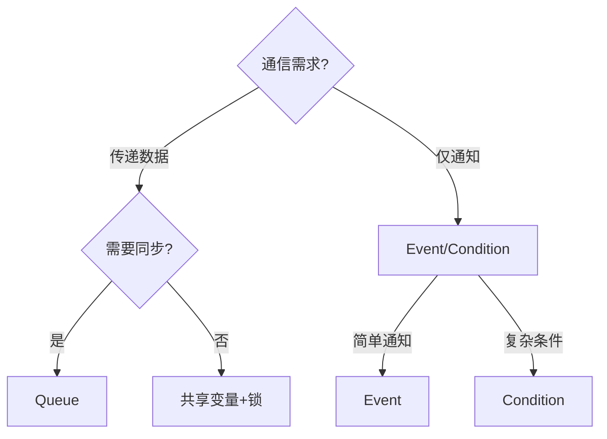

### **线程（Thread）的概念**
**线程**是操作系统能够调度的最小执行单元，是进程中的一个独立控制流。线程与进程的关键区别如下：

| 特性               | 进程（Process）                     | 线程（Thread）                     |
|--------------------|------------------------------------|------------------------------------|
| **资源分配**       | 独立内存空间、文件描述符等         | 共享进程资源（内存、文件等）       |
| **创建/切换成本**  | 高（需分配独立资源）               | 低（共享地址空间）                 |
| **隔离性**         | 完全隔离，崩溃不影响其他进程       | 共享内存，线程崩溃可能导致进程崩溃 |
| **并发性**         | 进程间需通过IPC通信                | 线程间可直接读写共享变量           |

**核心特点**：
- 同一进程的多个线程共享代码段、数据段和堆，但各自拥有独立的栈和寄存器。
- 线程由操作系统调度，在多核CPU上可真正并行执行（若不受GIL限制）。

---

### **线程间通信（Inter-Thread Communication）方式及适用场景**
由于线程共享进程内存，通信方式与进程间通信（IPC）有显著差异：

#### **1. 共享变量（Shared Variables）**
- **实现**：直接读写全局变量或对象属性  
- **特点**：  
  ✅ 零拷贝，速度最快  
  ❌ 需手动同步（否则出现竞态条件）  
- **场景**：  
  ```python
  # Python示例（需加锁）
  from threading import Lock
  shared_data = []
  lock = Lock()

  def thread_func():
      with lock:
          shared_data.append(1)
  ```

#### **2. 线程安全队列（Thread-Safe Queue）**
- **实现**：`queue.Queue`（Python标准库）  
- **特点**：  
  ✅ 自动处理同步  
  ✅ 支持生产者-消费者模式  
  ❌ 序列化/反序列化开销  
- **场景**：  
  ```python
  from queue import Queue
  q = Queue()

  def producer():
      q.put("data")

  def consumer():
      print(q.get())  # 阻塞直到有数据
  ```

#### **3. 条件变量（Condition）**
- **实现**：`threading.Condition`  
- **特点**：  
  ✅ 高效线程唤醒机制  
  ❌ 逻辑复杂度较高  
- **场景**：事件通知（如任务完成触发动作）  
  ```python
  from threading import Condition
  cond = Condition()
  flag = False

  def waiter():
      with cond:
          while not flag:
              cond.wait()  # 释放锁并等待
          print("Flag is set!")

  def setter():
      with cond:
          global flag
          flag = True
          cond.notify_all()  # 唤醒所有等待线程
  ```

#### **4. 事件（Event）**
- **实现**：`threading.Event`  
- **特点**：  
  ✅ 简单二进制状态通知  
  ❌ 无法传递数据  
- **场景**：单向信号通知  
  ```python
  from threading import Event
  e = Event()

  def worker():
      print("Waiting...")
      e.wait()  # 阻塞直到事件触发
      print("Running")

  e.set()  # 解除所有阻塞
  ```

#### **5. 信号量（Semaphore）**
- **实现**：`threading.Semaphore`  
- **特点**：  
  ✅ 控制并发访问数量  
  ❌ 过度使用易死锁  
- **场景**：资源池管理（如数据库连接池）  
  ```python
  from threading import Semaphore
  sem = Semaphore(3)  # 最多3个线程同时访问

  def access_resource():
      with sem:
          print("Using resource...")
  ```

#### **6. 屏障（Barrier）**
- **实现**：`threading.Barrier`  
- **特点**：  
  ✅ 同步多个线程的执行阶段  
  ❌ 不适用于动态线程数  
- **场景**：多阶段并行计算  
  ```python
  from threading import Barrier
  b = Barrier(2)  # 需2个线程到达才放行

  def phase1():
      print("Phase 1 done")
      b.wait()  # 等待其他线程
  ```

---

### **通信方式选型决策树**


---

### **关键场景总结**
| 场景                      | 推荐方式              | 原因                                                                 |
|---------------------------|-----------------------|----------------------------------------------------------------------|
| **高频小数据交换**        | 共享变量 + 锁         | 零拷贝，性能最高（需处理好竞态）                                    |
| **生产者-消费者**         | `Queue`               | 内置线程安全，避免轮询浪费CPU                                       |
| **任务协调（如启动同步）**| `Barrier`             | 明确阶段划分，避免部分线程提前执行                                  |
| **资源池限制**            | `Semaphore`           | 精确控制并发数（如数据库连接池）                                    |
| **事件驱动架构**          | `Condition`           | 支持精细化的等待/唤醒逻辑                                           |

---

### **注意事项**
1. **Python的GIL限制**：CPU密集型任务中，多线程可能无法提升性能（需改用多进程）。
2. **死锁预防**：避免嵌套锁（如锁A未释放时申请锁B）。
3. **优先级反转**：高优先级线程被低优先级线程阻塞时，需设置锁的优先级继承。

通过合理选择通信方式，可构建高效且安全的并发程序。