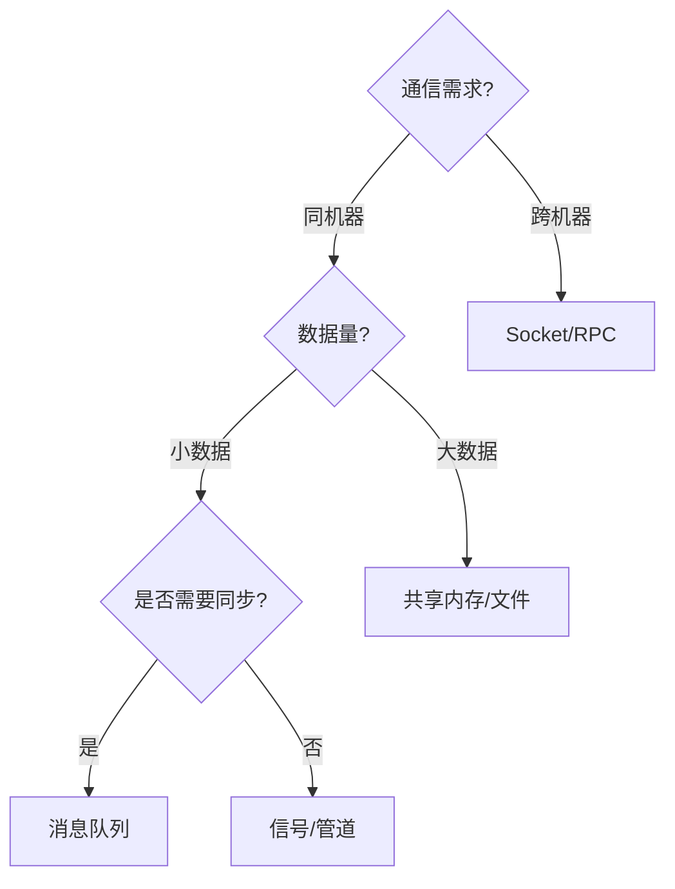

### **进程（Process）的定义与描述**
**进程**是操作系统进行资源分配和调度的基本单位，是程序的一次动态执行实例。它具有以下核心特征：

| 特性                | 说明                                                                 |
|---------------------|----------------------------------------------------------------------|
| **独立性**          | 拥有独立的虚拟地址空间、文件描述符、环境变量等，互不干扰             |
| **并发性**          | 多个进程可同时运行（宏观并行，微观交替）                             |
| **动态性**          | 有创建、运行、休眠、终止等生命周期                                   |
| **资源开销大**      | 进程创建和上下文切换成本高（需保存/恢复寄存器、内存映射等）          |

**示例描述**：  
当运行一个Python脚本时，操作系统会创建一个进程，分配内存空间加载代码和数据。若同时启动两个脚本，则生成两个独立进程，即使它们运行相同的代码。

---

### **进程间通信（IPC）方式及适用场景**
由于进程间内存隔离，必须通过特定机制通信。以下是主要IPC方式及其适用场景：

#### **1. 管道（Pipe）**
- **实现**：单向字节流，通过 `|` 符号或 `os.pipe()` 创建  
- **特点**：  
  ✅ 简单高效  
  ❌ 只能父子进程通信  
  ❌ 单向通信  
- **场景**：  
  ```python
  # 父进程写入，子进程读取
  import os
  r, w = os.pipe()
  if os.fork() == 0:  # 子进程
      os.close(w)
      data = os.read(r, 100)
  else:               # 父进程
      os.close(r)
      os.write(w, b"Hello")
  ```

#### **2. 消息队列（Message Queue）**
- **实现**：`multiprocessing.Queue` 或系统级队列（如POSIX消息队列）  
- **特点**：  
  ✅ 支持多对多通信  
  ✅ 可传递结构化数据  
  ❌ 需要序列化/反序列化开销  
- **场景**：  
  ```python
  from multiprocessing import Process, Queue
  def worker(q):
      q.put(["result", 42])
  q = Queue()
  p = Process(target=worker, args=(q,))
  p.start()
  print(q.get())  # 输出: ['result', 42]
  ```

#### **3. 共享内存（Shared Memory）**
- **实现**：`multiprocessing.Value`/`Array` 或 `mmap` 模块  
- **特点**：  
  ✅ 速度最快（直接内存访问）  
  ❌ 需手动处理同步（如锁）  
  ❌ 仅限同一台机器  
- **场景**：  
  ```python
  from multiprocessing import Process, Value
  def increment(v):
      v.value += 1
  counter = Value("i", 0)
  Process(target=increment, args=(counter,)).start()
  ```

#### **4. 信号（Signal）**
- **实现**：`signal` 模块（如 `SIGINT`、`SIGUSR1`）  
- **特点**：  
  ✅ 轻量级事件通知  
  ❌ 不能传递数据  
  ❌ 可能被阻塞或丢失  
- **场景**：  
  ```python
  import signal
  def handler(signum, frame):
      print("Received signal", signum)
  signal.signal(signal.SIGUSR1, handler)
  ```

#### **5. 套接字（Socket）**
- **实现**：TCP/UDP sockets（跨网络通信）  
- **特点**：  
  ✅ 支持跨机器通信  
  ✅ 全双工通信  
  ❌ 协议解析复杂  
- **场景**：  
  ```python
  # 服务端
  import socket
  s = socket.socket()
  s.bind(("localhost", 9999))
  s.listen()
  conn, addr = s.accept()
  conn.send(b"Hello")

  # 客户端
  s = socket.socket()
  s.connect(("localhost", 9999))
  print(s.recv(1024))  # 输出: b"Hello"
  ```

#### **6. 文件/内存映射文件**
- **实现**：`open()` + 锁 或 `mmap`  
- **特点**：  
  ✅ 持久化存储  
  ❌ 需处理并发写入冲突  
- **场景**：  
  ```python
  import mmap
  with open("data.bin", "r+b") as f:
      mm = mmap.mmap(f.fileno(), 0)
      mm.write(b"New Data")
      mm.close()
  ```

#### **7. 远程过程调用（RPC）**
- **实现**：gRPC、XML-RPC、Pyro  
- **特点**：  
  ✅ 跨语言/跨平台  
  ❌ 依赖网络稳定性  
- **场景**：  
  ```python
  # gRPC示例（需先定义.proto文件）
  import grpc
  channel = grpc.insecure_channel("localhost:50051")
  stub = pb2_grpc.MyServiceStub(channel)
  response = stub.MyMethod(request)
  ```

---

### **IPC方式选型决策树**


---

### **关键总结**
1. **同主机高速通信** → 共享内存  
2. **结构化数据交换** → 消息队列  
3. **跨网络通信** → Socket/RPC  
4. **简单通知** → 信号  
5. **父子进程协作** → 管道  

根据**延迟要求**、**数据规模**和**系统架构**选择最合适的IPC方式。例如：
- 实时交易系统 → 共享内存 + 信号量  
- 分布式微服务 → gRPC  
- 日志收集 → 消息队列