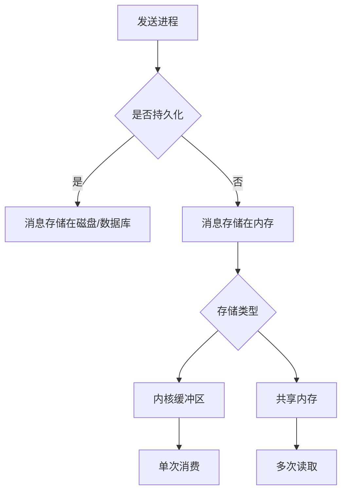

## 关于非持久化IPC消息消费的深度解析

对于不支持持久化的进程间通信(IPC)方式，消息的消费行为取决于具体的通信机制，不能简单地用**只能被消费一次**来概括。以下是详细分析：

### 一、消息消费模式分类

| 通信方式          | 消费性质       | 消息生命周期               | 典型代表                  |
|-------------------|----------------|---------------------------|--------------------------|
| **队列型**        | 单次消费       | 被获取后立即删除           | Pipe, multiprocessing.Queue |
| **共享状态型**    | 可重复读取     | 持续存在直到被覆盖         | 共享内存, Value/Array     |
| **广播型**        | 单次传递       | 瞬时存在不存储             | 信号(Signal), 事件(Event) |

### 二、具体机制分析

#### 1. 队列型IPC（真正单次消费）
```python
from multiprocessing import Queue

q = Queue()
q.put("消息1")  # 消息存入内核缓冲区

# 进程A
msg = q.get()  # 消息从内核移除，其他进程无法再次获取
print(msg)     # 输出"消息1"

# 进程B
msg = q.get()  # 将永久阻塞，因为消息已被取出
```

**技术本质**：
- 消息存储在内核维护的缓冲区
- `get()`操作是破坏性读取（类似POP操作）
- 如果没有消费者，消息会保留直到进程结束

#### 2. 共享内存型（可重复读取）
```python
from multiprocessing import Value, Process

counter = Value('i', 0)  # 共享整数

def worker(num):
    print(f"进程{num}读取: {counter.value}")  # 可被多个进程重复读取
    if num == 1:
        counter.value = 42  # 修改对所有进程可见

Process(target=worker, args=(1,)).start()
Process(target=worker, args=(2,)).start()
```

**技术本质**：
- 消息持续存在于共享内存区域
- 读取操作不会改变存储状态
- 类似"黑板"模式，所有进程可见最新值

#### 3. 管道(Pipe)的特殊情况
```python
from multiprocessing import Pipe

parent_conn, child_conn = Pipe()

parent_conn.send("重要消息") 

# 情况1：单消费者
msg = child_conn.recv()  # 消息被取出，连接中不再存在

# 情况2：多消费者竞争
# 如果有多个进程尝试recv()，只有一个能获取到消息
```

### 三、持久化 vs 非持久化的本质区别



### 四、生产环境中的应对策略

1. **需要消息重放时**：
   ```python
   # 使用共享内存实现简易重放缓存
   from multiprocessing import Manager
   manager = Manager()
   replay_cache = manager.list()

   def producer():
       replay_cache.append("消息1")  # 消息会保留在列表中

   def consumer():
       for msg in replay_cache:    # 所有消费者都能遍历历史消息
           print(msg)
   ```

2. **临时队列的容错方案**：
   ```python
   # 双队列实现简单确认机制
   main_q = Queue()
   ack_q = Queue()

   # 消费者获取消息后必须显式确认
   msg = main_q.get()
   process(msg)
   ack_q.put(msg.id)  # 生产者根据ack队列判断是否要重发
   ```

3. **性能敏感场景的优化**：
   ```python
   # 使用环形缓冲区避免内存无限增长
   from collections import deque
   shared_deque = manager.deque(maxlen=100)  # 只保留最近100条消息
   ```

### 五、不同IPC方式的消息行为对照表

| IPC方式                | 存储位置       | 消费次数 | 消息保留时间               | 典型应用场景             |
|------------------------|----------------|----------|---------------------------|--------------------------|
| multiprocessing.Queue  | 内核缓冲区     | 1次      | 直到被消费                 | 生产者-消费者模型        |
| Pipe                   | 内核管道缓冲   | 1次      | 直到被读取                 | 双向进程通信            |
| Redis/RabbitMQ         | 磁盘/内存      | 可配置   | 可永久保存                 | 分布式系统              |
| Shared Memory          | 进程共享内存   | 无限次   | 直到被覆盖或进程结束       | 高频数据共享           |
| Signal                 | 内核信号队列   | 1次      | 瞬时传递                   | 进程控制               |
| Manager.dict/list      | Manager进程    | 无限次   | 直到显式删除               | 复杂数据结构共享       |

### 六、设计建议

1. **需要严格单次消费**：
   - 选择队列型IPC（Queue/Pipe）
   - 配合ACK确认机制确保可靠处理

2. **需要消息重放**：
   - 使用共享内存或Manager托管数据结构
   - 考虑使用环形缓冲区控制内存占用

3. **从临时IPC迁移到持久化**：
   ```python
   # 过渡方案示例
   class HybridQueue:
       def __init__(self):
           self._mem_q = Queue()  # 内存队列
           self._persistent_store = Redis()  # 持久化存储
       
       def put(self, msg):
           self._mem_q.put(msg)
           self._persistent_store.rpush('backup', msg)
   ```

理解这些底层机制可以帮助开发者根据消息的重要性、性能要求和可靠性需求，选择最适合的进程间通信方案。对于关键业务数据，即使使用非持久化IPC，也应通过应用层设计实现必要的可靠性保障。