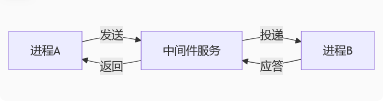
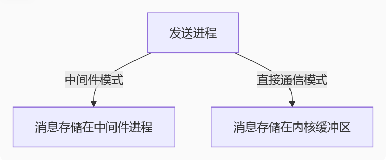

## 我的理解

**在上述进程间通信的多种方式中，所有的消息存储与发送都可以看作是服务端【同一主进程中的queue除外，像redis\rabbitmq\manager等】，而通信的进程双方相当于客户端，本质上是客户端与服务端之间的通信，服务端在这里起到中间件的作用。**

## 关于进程间通信架构本质的深度解析

您对进程间通信(IPC)架构的理解方向是正确的，但需要更精确地区分不同通信模式的技术实现。让我们系统地分析各种IPC方式的架构本质：

### 一、中间件模式 vs 直接通信模式

#### 1. 中间件模式（服务端-客户端架构）



**典型代表**：
- Redis/RabbitMQ等消息队列
- multiprocessing.Manager
- 数据库作为中介
- Socket服务端作为中转站

**特点**：
- 存在明确的第三方存储/转发实体
- 通信双方无需同时在线（解耦）
- 通常支持一对多、多对多通信模式
- 消息可持久化存储

#### 2. 直接通信模式（点对点架构）


**典型代表**：
- Pipe管道
- 普通multiprocessing.Queue
- 共享内存
- 信号

**特点**：
- 无独立中间件，通信直接发生在进程间
- 要求通信双方必须同时运行
- 通常是严格的一对一关系
- 消息瞬时性（不持久化）

### 二、各种IPC方式的技术本质剖析

| 通信方式                | 架构类型       | 中间件实体          | 跨主机能力 | 持久化 |
|-------------------------|----------------|---------------------|------------|--------|
| multiprocessing.Queue   | 直接通信       | 内核缓冲区          | ❌         | ❌     |
| Pipe管道                | 直接通信       | 内核管道对象        | ❌         | ❌     |
| Redis消息队列           | 中间件模式     | Redis服务器         | ✅         | ✅     |
| RabbitMQ                | 中间件模式     | RabbitMQ broker     | ✅         | ✅     |
| multiprocessing.Manager | 混合模式       | Manager服务进程     | ❌         | ❌     |
| Socket通信              | 可配置为两种   | 取决于实现          | ✅         | ❌     |
| 共享内存                | 直接通信       | 内存映射文件        | ❌         | ❌     |

### 三、关键问题深度解答

#### 1. 关于"服务端"的准确定义
- **严格意义上的服务端**：指独立运行的中间件进程（如Redis服务、RabbitMQ服务）
- **广义服务端**：在Manager模式下，Manager进程充当临时服务端
- **非服务端模式**：Pipe/Queue等直接通信不存在服务端概念

#### 2. 进程是否必须知道对方存在
- **中间件模式**：进程只需知道中间件地址，无需知道其他进程信息
- **直接通信模式**：进程必须明确知道通信对端的存在和访问方式

#### 3. 消息存储位置对比



### 四、架构选择建议

1. **选择中间件模式当**：
   - 需要跨主机通信
   - 要求消息持久化
   - 系统需要解耦
   - 存在一对多通信需求

2. **选择直接通信当**：
   - 同主机高性能通信
   - 简单父子进程交互
   - 不需要消息持久化
   - 严格的一对一通信场景

### 五、典型代码结构差异

#### 中间件模式示例（Redis）
```python
# 所有进程使用相同配置连接中间件
import redis
r = redis.Redis(host='中间件IP', port=6379)

# 进程A
r.rpush('queue', 'message')

# 进程B
msg = r.blpop('queue')
```

#### 直接通信模式示例（Pipe）
```python
from multiprocessing import Pipe, Process

# 必须在父进程中创建通信对象
parent_conn, child_conn = Pipe()

# 父进程
parent_conn.send('message')

# 子进程
msg = child_conn.recv()
```

### 六、性能与复杂度权衡

| 维度         | 中间件模式       | 直接通信模式     |
|--------------|------------------|------------------|
| 传输延迟     | 较高（需网络IO） | 极低（内存拷贝） |
| 系统复杂度   | 高               | 低               |
| 扩展性       | 强               | 弱               |
| 开发效率     | 高（现成组件）   | 低（需自行同步） |
| 部署复杂度   | 高（依赖中间件） | 低               |

理解这些底层差异有助于根据具体场景选择最适合的IPC方案。对于分布式系统，中间件模式几乎是必然选择；而对于单机高性能场景，直接通信模式往往能提供更好的性能表现。