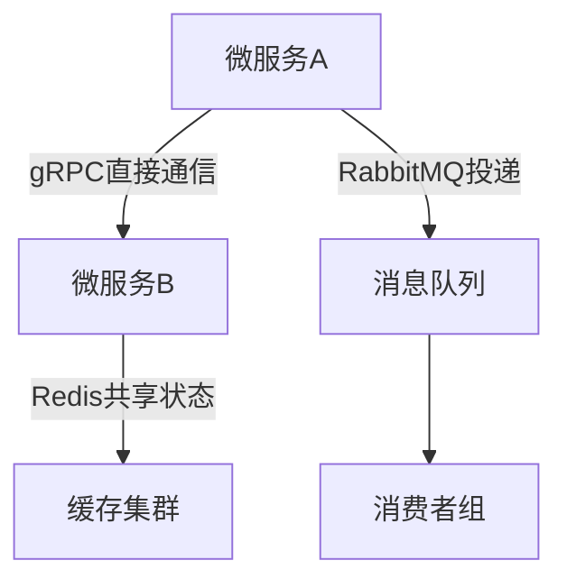
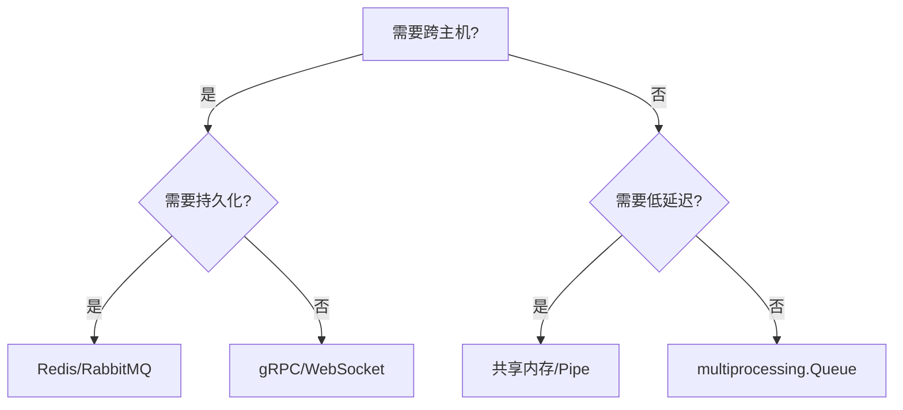

## 个人理解

IPC通信的方式是否可以分为两大类，一类是进程间通过通信协议直接连接通信，另一类是进程间通过消息媒介【同一主进程采用队列，同一主机不同主进程采用manager/redis/rabbitmq，不同主机采用redis/rabbitmq】通信。

## IPC通信方式的科学分类

您提出的分类方式基本合理，但需要更精确的技术界定。根据操作系统原理和分布式系统理论，IPC通信方式可以按照通信范式分为以下两大类：

### 一、直接通信（Direct Communication）
**本质特征**：进程间建立显式的直接连接通道，无需第三方媒介存储消息。

#### 技术实现细分：
1. **同一主机内**：
   - **管道（Pipe）**：单向字节流，如`os.pipe()`
   ```python
   r, w = os.pipe()
   os.write(w, b"message")  # 进程A
   os.read(r, 100)         # 进程B
   ```
   - **Unix域套接字**：高性能本地通信
   ```python
   sock = socket.socket(socket.AF_UNIX)
   sock.connect("/tmp/socket.sock")
   ```
   - **共享内存**：mmap/multiprocessing.Value
   ```python
   from multiprocessing import Value
   counter = Value('i', 0)  # 进程间共享的整型变量
   ```

2. **跨主机**：
   - **网络套接字**：TCP/UDP通信
   ```python
   # 进程A（服务端）
   sock = socket.socket(socket.AF_INET, socket.SOCK_STREAM)
   sock.bind(('0.0.0.0', 8080))
   
   # 进程B（客户端）
   sock = socket.socket(socket.AF_INET, socket.SOCK_STREAM)
   sock.connect(('server_ip', 8080))
   ```

#### 核心特点：
- 通信双方必须同时在线
- 点对点连接拓扑
- 低延迟（特别是本地通信）
- 无中间存储，消息瞬时传递

### 二、间接通信（Indirect Communication）
**本质特征**：通过中间媒介（如队列、共享存储）实现解耦的消息传递。

#### 技术实现细分：
1. **同一进程内**：
   - `queue.Queue`：线程安全的内存队列

2. **同一主机跨进程**：
   - **multiprocessing.Queue**：跨进程队列
   ```python
   q = multiprocessing.Queue()
   q.put("msg")  # 进程A
   q.get()       # 进程B
   ```
   - **Manager**：代理共享对象
   ```python
   manager = multiprocessing.Manager()
   shared_dict = manager.dict()  # 跨进程共享的字典
   ```

3. **跨主机**：
   - **消息代理**：RabbitMQ/ActiveMQ
   ```python
   # 生产者
   channel.basic_publish(exchange='', routing_key='queue', body='msg')
   
   # 消费者
   channel.basic_consume(queue='queue', on_message_callback=callback)
   ```
   - **键值存储**：Redis
   ```python
   r = redis.Redis()
   r.rpush('queue', 'msg')  # 生产者
   r.blpop('queue')         # 消费者
   ```

#### 核心特点：
- 通信双方无需同时在线（解耦）
- 支持发布-订阅等复杂模式
- 消息可持久化存储
- 存在中间件性能开销

### 三、分类对比矩阵

| 维度               | 直接通信                     | 间接通信                     |
|--------------------|-----------------------------|-----------------------------|
| **耦合度**         | 紧耦合（需知对方地址）       | 松耦合（只需知媒介地址）     |
| **消息存储**       | 无                          | 有（内存/磁盘）             |
| **拓扑结构**       | 点对点                      | 支持多对多                  |
| **典型延迟**       | 微秒级（本地）              | 毫秒级以上                  |
| **容错性**         | 弱（连接中断即失败）         | 强（消息可重试/持久化）      |
| **代表实现**       | Pipe/Socket/共享内存         | Queue/Redis/RabbitMQ        |

### 四、混合架构实践案例

现代分布式系统常组合使用两种模式：


1. **关键路径**：使用直接通信（如gRPC）保证低延迟
2. **异步任务**：通过消息队列解耦
3. **状态共享**：利用Redis作为分布式缓存

### 五、协议栈层级视角

```
应用层
├── 间接通信：HTTP/REST, AMQP, MQTT
└── 直接通信：gRPC, Thrift, ZeroMQ

传输层
├── 间接通信：基于TCP的消息存储转发
└── 直接通信：原始TCP/UDP通信

内核层
├── 间接通信：内核消息队列(msg_queue)
└── 直接通信：共享内存、信号
```

### 六、选型决策树



这种分类方式不仅适用于技术选型，也深刻影响了系统架构设计。理解这两类通信范式的本质差异，是构建高可靠分布式系统的基础。在实际工程中，通常会根据业务场景组合使用多种通信模式。