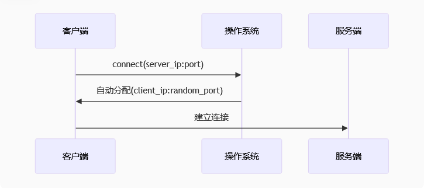

# Socket通信中客户端和服务端的绑定机制解析

## 客户端为什么不需要显式绑定IP和端口

在基于Socket的全双工通信中，客户端通常不需要显式绑定IP和端口的原因如下：

1. **自动分配机制**：
   - 当客户端不调用`bind()`时，操作系统会在`connect()`时自动完成以下工作：
     - 自动分配一个**可用临时端口**（ephemeral port，通常范围是32768-60999）
     - 自动绑定到**所有可用网络接口**（0.0.0.0）

2. **设计合理性**：
   - 客户端通常不需要固定端口（服务端需要固定端口供客户端连接）
   - 同一台机器可以运行多个客户端实例，自动分配端口避免了冲突
   - 客户端更关注服务端的地址，自身地址不重要

3. **TCP/IP协议栈行为**：

   

## 服务端为什么必须绑定IP和端口

1. **服务端需要可寻址性**：
   - 客户端必须知道明确的服务端地址才能发起连接
   - 服务端需要固定端口提供长期服务

2. **绑定参数详解**：
   ```python
   s.bind(('0.0.0.0', 65432))  # 绑定到所有网络接口的65432端口
   ```
   - `0.0.0.0`表示绑定到所有可用网络接口
   - 也可以指定具体IP（如`192.168.1.100`）只绑定到特定网卡

## 一个进程是否必须对应一个IP和端口

1. **基本关系**：
   - **一个端口一次只能被一个进程监听**（防止冲突）
   - **一个进程可以绑定多个端口**（创建多个socket）
   - **一个端口可以有多个连接**（服务端端口）

2. **典型场景分析**：

   | 场景 | IP:端口关系 | 说明 |
   |------|------------|------|
   | 普通服务端 | 1进程:1监听端口 | 如Web服务器监听80端口 |
   | 多服务进程 | N进程:N端口 | 如微服务架构 |
   | 端口复用 | 多进程共享端口 | 需要SO_REUSEADDR选项 |
   | 多网卡服务器 | 1进程绑定多个IP | 不同网卡提供相同服务 |

3. **端口复用示例**：
   ```python
   s = socket.socket(socket.AF_INET, socket.SOCK_STREAM)
   s.setsockopt(socket.SOL_SOCKET, socket.SO_REUSEADDR, 1)  # 设置端口复用
   s.bind(('0.0.0.0', 65432))
   ```

## 深入理解：TCP连接四元组

实际上每个TCP连接由**四元组**唯一标识：
```
{源IP, 源端口, 目标IP, 目标端口}
```

示例：
```
客户端A: 192.168.1.100:54321 → 服务端: 10.0.0.1:80
客户端B: 192.168.1.101:12345 → 服务端: 10.0.0.1:80
```
虽然服务端是同一个IP:端口，但两个连接是完全独立的。

## 实际应用建议

1. **客户端最佳实践**：
   - 通常不手动绑定，使用自动分配
   - 特殊场景需要绑定时（如防火墙白名单）：
     ```python
     client_socket.bind(('client_ip', client_port))
     ```

2. **服务端注意事项**：
   - 生产环境建议绑定具体IP而非0.0.0.0（安全考虑）
   - 端口选择应避开知名端口（0-1023）
   - 考虑设置SO_REUSEADDR以便快速重启

3. **调试技巧**：
   - 查看端口分配：
     ```bash
     # Linux
     netstat -tulnp
     # Windows
     netstat -ano
     ```

这种设计体现了网络通信的灵活性：服务端需要稳定可寻址，客户端则追求最大程度的自动化和灵活性。