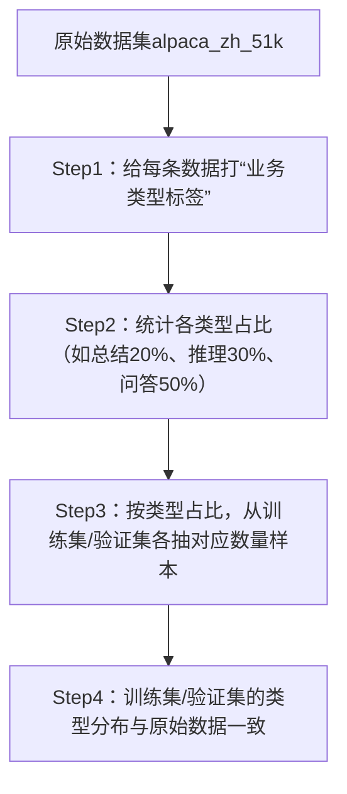

### 我的疑问

```text
通过使用Lora微调后的模型推理测试，我发现alpaca_zh_51k数据集中的对话数据看起来可以分类，有些是总结归纳类的，有些算法推理类的。因此我想到一个问题：前期微调时，没有考虑数据集本身的业务类型，一股脑地取前若干条，然后进行训练集和验证集的划分，就进行微调了。这种方式很可能导致参与微调训练的数据集各业务类型划分失衡，导致模型微调效果不均
```

你提出的这个问题是微调过程中**数据层面最核心的优化方向之一**——“随机取数+无业务分层”的方式确实会导致数据集类型分布失衡，最终表现为模型在部分业务类型（如算法推理）上效果好，另一部分（如总结归纳）效果差，甚至出现“会算题但不会总结”的情况。

下面我会从「问题本质」「解决方案」「落地代码」三个维度，帮你彻底解决数据集类型分布失衡的问题，让微调后的模型在各业务类型上效果均衡。

### 一、问题本质：“随机抽样”≠“分层抽样”，导致类型分布失衡
alpaca_zh_51k包含多种业务类型（总结归纳、算法推理、知识问答、创意生成等），如果直接取前3万条/随机抽3万条，可能出现：
- 算法推理类占比80%，总结归纳类仅占5%；
- 验证集里全是算法推理题，完全没有总结归纳题；
最终模型“偏科”——算法推理回答精准，但总结归纳逻辑混乱。

核心矛盾：**微调的目标是让模型适配「全业务类型」，但数据抽样未保证各类型的「比例均衡」和「训练/验证分布一致」**。

### 二、核心解决方案：分层抽样（Stratified Sampling）
#### 1. 分层抽样的核心逻辑

核心目标：**训练集和验证集的业务类型分布完全对齐**，既保证模型学到所有类型的知识，又能通过验证集客观评估各类型的效果。

#### 2. 落地步骤（分4步）
##### 步骤1：给数据集打“业务类型标签”
首先需要对alpaca_zh_51k的每条数据标注业务类型，有两种方式：
- **方式1：规则匹配（低成本、快速）**：通过关键词匹配自动打标签（适合简单分类）；
- **方式2：人工标注（高精度）**：抽样标注核心类型，再用规则补全（适合复杂场景）。

##### 步骤2：统计各类型占比
计算原始数据中各业务类型的占比，确保抽样后占比不变。

##### 步骤3：分层划分训练集/验证集
按类型占比，在每个类型内部划分训练集（95%）和验证集（5%），而非全局随机划分。

##### 步骤4：用分层后的数据集微调
确保训练/验证过程中，各类型数据的比例与真实业务一致。

### 三、完整落地代码（适配alpaca_zh_51k）
下面是可直接运行的代码，包含「自动打标签+分层抽样+保存分层数据集」全流程：

```python
import json
import random
import pandas as pd
from collections import defaultdict

# ====================== 配置项 ======================
RAW_DATA_PATH = "../../alpaca_zh/alpaca_data_zh_51k.json"  # 原始数据集路径
STRATIFIED_DATA_PATH = "./alpaca_zh_stratified"  # 分层后数据集保存路径
TRAIN_RATIO = 0.95  # 训练集比例
SEED = 42  # 固定随机种子，保证结果可复现

# ====================== 步骤1：定义业务类型规则 ======================
def label_business_type(instruction: str) -> str:
    """
    规则匹配：给每条指令打业务类型标签
    可根据实际需求扩展规则
    """
    instruction = instruction.lower().strip()
    
    # 1. 总结归纳类（包含“总结”“归纳”“概括”“摘要”等关键词）
    if any(key in instruction for key in ["总结", "归纳", "概括", "摘要", "整理"]):
        return "总结归纳"
    
    # 2. 算法推理类（包含“计算”“推理”“解题”“算”“证明”等关键词）
    elif any(key in instruction for key in ["计算", "推理", "解题", "算", "证明", "推导", "公式"]):
        return "算法推理"
    
    # 3. 知识问答类（包含“是什么”“为什么”“怎么样”“多少”“哪里”等）
    elif any(key in instruction for key in ["是什么", "为什么", "怎么样", "多少", "哪里", "谁", "何时", "如何"]):
        return "知识问答"
    
    # 4. 创意生成类（包含“写”“创作”“生成”“编”“设计”等）
    elif any(key in instruction for key in ["写", "创作", "生成", "编", "设计", "构思", "仿写"]):
        return "创意生成"
    
    # 5. 其他类型
    else:
        return "其他"

# ====================== 步骤2：加载数据并打标签 ======================
def load_and_label_data():
    # 加载原始数据
    with open(RAW_DATA_PATH, "r", encoding="utf-8") as f:
        raw_data = json.load(f)
    
    # 打标签
    labeled_data = []
    type_count = defaultdict(int)  # 统计各类型数量
    for idx, sample in enumerate(raw_data):
        instruction = sample.get("instruction", "")
        input_text = sample.get("input", "")
        output_text = sample.get("output", "")
        
        # 合并指令+输入，提升标签准确性
        full_text = instruction + " " + input_text
        business_type = label_business_type(full_text)
        
        labeled_sample = {
            "id": idx,
            "instruction": instruction,
            "input": input_text,
            "output": output_text,
            "business_type": business_type
        }
        labeled_data.append(labeled_sample)
        type_count[business_type] += 1
    
    # 打印类型分布
    print("===== 原始数据业务类型分布 =====")
    total = len(labeled_data)
    for type_name, count in type_count.items():
        print(f"{type_name}: {count}条（{count/total*100:.2f}%）")
    
    return labeled_data, type_count

# ====================== 步骤3：分层抽样 ======================
def stratified_split(labeled_data):
    # 按业务类型分组
    type_to_samples = defaultdict(list)
    for sample in labeled_data:
        type_to_samples[sample["business_type"]].append(sample)
    
    train_data = []
    val_data = []
    
    # 对每个类型单独划分训练/验证集
    for type_name, samples in type_to_samples.items():
        random.seed(SEED)
        random.shuffle(samples)  # 打乱该类型样本
        
        # 计算该类型的训练集数量
        train_num = int(len(samples) * TRAIN_RATIO)
        
        # 划分
        train_samples = samples[:train_num]
        val_samples = samples[train_num:]
        
        train_data.extend(train_samples)
        val_data.extend(val_samples)
        
        # 打印该类型的划分结果
        print(f"\n===== {type_name} 划分结果 =====")
        print(f"训练集：{len(train_samples)}条，验证集：{len(val_samples)}条")
    
    # 打乱训练集/验证集（避免同类型样本扎堆）
    random.seed(SEED)
    random.shuffle(train_data)
    random.shuffle(val_data)
    
    # 验证整体划分比例
    print(f"\n===== 整体划分结果 =====")
    print(f"训练集总数：{len(train_data)}条（{len(train_data)/(len(train_data)+len(val_data))*100:.2f}%）")
    print(f"验证集总数：{len(val_data)}条（{len(val_data)/(len(train_data)+len(val_data))*100:.2f}%）")
    
    return train_data, val_data

# ====================== 步骤4：保存分层后的数据集 ======================
def save_stratified_data(train_data, val_data):
    # 创建保存目录
    import os
    if not os.path.exists(STRATIFIED_DATA_PATH):
        os.makedirs(STRATIFIED_DATA_PATH)
    
    # 保存训练集/验证集（保留原始格式，仅新增business_type字段）
    train_save_path = os.path.join(STRATIFIED_DATA_PATH, "train.json")
    val_save_path = os.path.join(STRATIFIED_DATA_PATH, "val.json")
    
    # 移除id字段（可选，不影响微调）
    train_data_clean = [{k: v for k, v in s.items() if k != "id"} for s in train_data]
    val_data_clean = [{k: v for k, v in s.items() if k != "id"} for s in val_data]
    
    with open(train_save_path, "w", encoding="utf-8") as f:
        json.dump(train_data_clean, f, ensure_ascii=False, indent=2)
    
    with open(val_save_path, "w", encoding="utf-8") as f:
        json.dump(val_data_clean, f, ensure_ascii=False, indent=2)
    
    print(f"\n✅ 分层后的数据集已保存至：{STRATIFIED_DATA_PATH}")
    print(f"训练集路径：{train_save_path}")
    print(f"验证集路径：{val_save_path}")

# ====================== 主函数 ======================
if __name__ == "__main__":
    # 步骤1：加载数据并打标签
    labeled_data, type_count = load_and_label_data()
    
    # 步骤2：分层抽样
    train_data, val_data = stratified_split(labeled_data)
    
    # 步骤3：保存数据
    save_stratified_data(train_data, val_data)
    
    # （可选）统计分层后训练/验证集的类型分布
    print("\n===== 训练集类型分布 =====")
    train_type_count = defaultdict(int)
    for sample in train_data:
        train_type_count[sample["business_type"]] += 1
    for type_name, count in train_type_count.items():
        print(f"{type_name}: {count}条（{count/len(train_data)*100:.2f}%）")
    
    print("\n===== 验证集类型分布 =====")
    val_type_count = defaultdict(int)
    for sample in val_data:
        val_type_count[sample["business_type"]] += 1
    for type_name, count in val_type_count.items():
        print(f"{type_name}: {count}条（{count/len(val_data)*100:.2f}%）")
```

### 四、关键优化点&使用说明
#### 1. 代码核心优势
- **规则可扩展**：可根据alpaca_zh_51k的实际数据特征，新增/修改业务类型规则（比如新增“翻译类”“代码生成类”）；
- **分布可验证**：代码会打印原始数据、训练集、验证集的类型分布，确保三者比例一致；
- **结果可复现**：固定随机种子，多次运行结果相同。

#### 2. 如何用分层后的数据集微调？
只需将之前微调代码中的“加载原始数据”部分，替换为加载分层后的`train.json`和`val.json`：
```python
# 替换原数据加载逻辑
def load_data():
    # 加载分层后的训练集
    with open("./alpaca_zh_stratified/train.json", "r", encoding="utf-8") as f:
        train_data = json.load(f)
    
    # 加载分层后的验证集
    with open("./alpaca_zh_stratified/val.json", "r", encoding="utf-8") as f:
        val_data = json.load(f)
    
    return train_data, val_data
```

#### 3. 进阶优化（可选）
- **类型权重调整**：如果某类业务（如总结归纳）更重要，可在微调时设置「类型权重」，让模型更关注该类型；
- **人工修正标签**：对规则打标签错误的样本（如10%抽样）人工修正，提升标签准确性；
- **多轮分层**：如果数据量极大，可先按“大类”分层，再按“子类”分层（如“知识问答”下分“历史问答”“科学问答”）。

### 五、总结
1. **核心问题**：随机抽样导致业务类型分布失衡，模型“偏科”；
2. **核心方案**：分层抽样——先打类型标签，再按类型比例划分训练/验证集；
3. **落地价值**：模型在各业务类型上的微调效果均衡，验证集能客观反映模型的真实能力；
4. **扩展建议**：规则标签可结合少量人工标注优化，复杂场景可引入轻量分类模型自动打标签。

按这个方案调整后，你会发现模型在总结归纳、算法推理等各类型任务上的回答效果更均衡，避免“会算题但不会总结”的问题。如果需要我补充「带类型权重的微调代码」，或者解释如何评估各类型的微调效果，都可以告诉我。