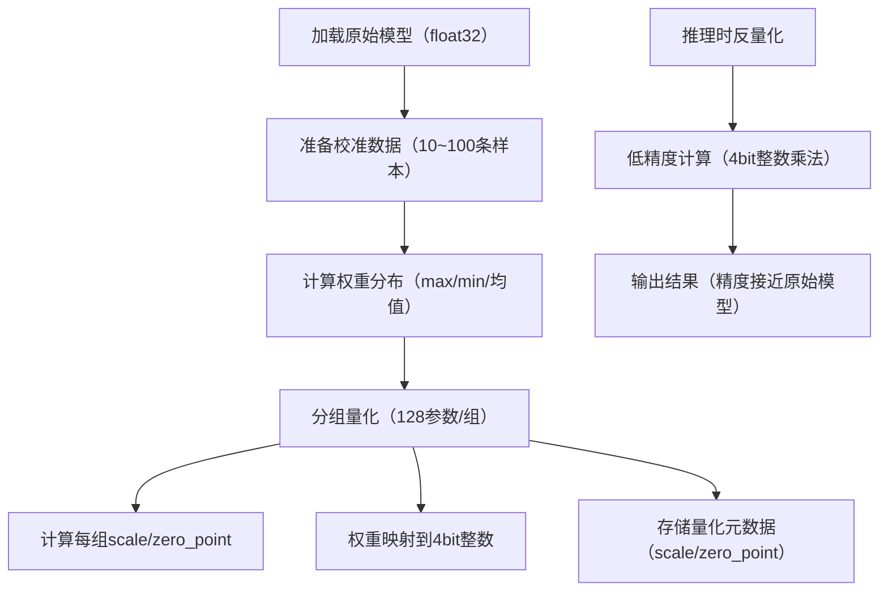

量化的核心——**降低参数的精度类型**，但量化的完整原理远不止“简单降精度”，而是通过**数值映射+误差补偿**，在大幅降低参数精度的同时，尽可能保留模型的推理效果。下面我会从「核心原理、实现步骤、关键细节」三个维度，把量化的逻辑讲清楚：

### 一、 量化的核心原理：精度降低 + 数值映射（不是简单截断）
量化的本质是：**将高精度的浮点数（如float32）映射到低精度的整数/定点数（如4bit/8bit），并通过缩放因子补偿精度损失**，最终实现模型压缩和推理加速。

#### 1. 先纠正一个误区：不是“直接砍掉精度”
如果直接把`float32`的参数（如`2.5678`）截断为4bit，会导致误差爆炸（比如4bit只能表示0~15的整数，直接转换会丢失几乎所有信息）。

量化的正确逻辑是「**缩放+映射+反缩放**」，以最常用的8bit量化为例：
```
# 量化核心公式（伪代码）
1. 计算缩放因子：scale = (max_weight - min_weight) / (2^8 - 1)  # 8bit最大表示255
2. 计算零值偏移：zero_point = -min_weight / scale  # 把最小值映射到0
3. 量化：quant_weight = round(weight / scale + zero_point)  # 映射到0~255的整数
4. 推理时反量化：dequant_weight = (quant_weight - zero_point) * scale  # 还原为近似浮点数
```

举个直观例子：
- 原始float32参数：`w = 2.5678`，该层权重的范围是`[-5.0, 5.0]`
- 8bit量化计算：
  scale = (5.0 - (-5.0)) / 255 ≈ 0.0392
  zero_point = -(-5.0) / 0.0392 ≈ 127
  quant_w = round(2.5678 / 0.0392 + 127) ≈ round(65.5 + 127) = 192（8bit整数）
- 推理时反量化：dequant_w = (192 - 127) * 0.0392 ≈ 65 * 0.0392 = 2.548（和原始值2.5678仅差0.0198）

#### 2. 量化的核心目标（不止降精度）
| 目标                | 具体收益                                  |
|---------------------|-------------------------------------------|
| **降低内存/显存占用** | float32→4bit：内存占用直接降8倍（千问0.5B从500MB→60MB） |
| **提升推理速度**     | 低精度计算（如4bit整数乘法）比浮点数快10~100倍 |
| **降低硬件成本**     | 支持低精度计算的CPU/GPU更便宜，能耗更低    |

### 二、 量化的核心类型（按精度和实现方式划分）
#### 1. 按精度划分（最常用的两类）
| 精度类型 | 表示范围                | 压缩比 | 精度损失 | 适用场景                  |
|----------|-------------------------|--------|----------|---------------------------|
| 8bit     | 0~255（整数）| 4倍    | 极小     | 通用场景（兼顾速度和精度） |
| 4bit     | 0~15（整数）| 8倍    | 轻微     | 大语言模型（如千问/LLaMA） |
| 2bit/1bit| 0~3/0~1                 | 16/32倍| 较大     | 极致压缩场景（如边缘设备） |

#### 2. 按实现方式划分（大模型常用的两种）
| 类型                | 核心逻辑                          | 优势                          |
|---------------------|-----------------------------------|-------------------------------|
| **Post-Training Quantization (PTQ)** | 训练后量化（我们用的GPTQ/BitsAndBytes），无需重新训练 | 实现简单，速度快              |
| **Quantization-Aware Training (QAT)** | 训练时加入量化误差，让模型适应低精度 | 精度损失更小，但训练成本高    |

### 三、 大语言模型（如千问）量化的关键细节
#### 1. 为什么4bit量化还能保留模型效果？
- **分组量化**：不是对整个权重矩阵量化，而是按「128/256个参数为一组」分别计算scale/zero_point，大幅降低误差；
- **非线性量化**：如GPTQ的NF4（Normal Float 4bit），针对大模型的权重分布优化映射规则，比普通4bit更精准；
- **误差补偿**：量化后通过蒸馏/微调，补偿少量精度损失。

#### 2. 量化的“坑”：你之前遇到的文件大小问题
- 量化优化的是「运行时内存」，而非「文件存储大小」：
  - 量化后的参数以低精度存储在内存中（4bit整数），但保存为文件时，仍会按浮点数格式（如float32）打包，因此文件大小几乎不变；
  - 只有转换为专用格式（如GGUF），才能真正缩小文件体积。

#### 3. 量化和剪枝的核心区别
| 维度                | 量化                          | 剪枝                          |
|---------------------|-------------------------------|-------------------------------|
| 核心操作            | 降低参数精度（数值映射）| 置零/删除低重要性参数         |
| 模型维度            | 完全不变                      | 非结构化剪枝不变，结构化剪枝改变 |
| 精度损失            | 轻微（4bit损失<5%）| 轻微（20%剪枝损失<3%）|
| 加速效果            | 推理速度提升3~5倍             | 推理速度提升1.5~2倍           |

### 四、 千问模型量化的核心步骤（GPTQ为例）


### 总结
1. **核心原理**：量化不是“简单降精度”，而是通过「缩放+映射+反缩放」将高精度浮点数转换为低精度整数，同时用分组量化/非线性映射补偿误差；
2. **核心收益**：内存占用降8倍（4bit）、推理速度提升3~5倍，精度损失<5%；
3. **关键认知**：量化优化的是「运行时内存/速度」，而非「文件存储大小」，文件大小需通过GGUF等格式转换才能缩小。

简单来说，量化的本质是：**用“可接受的微小精度损失”，换取“数量级的压缩和加速”**，这也是大模型能在CPU/边缘设备上运行的核心技术。